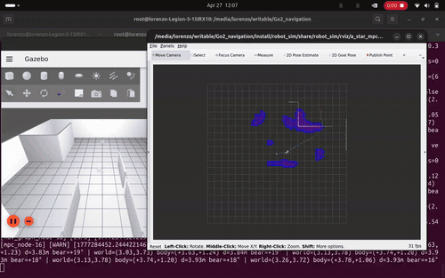
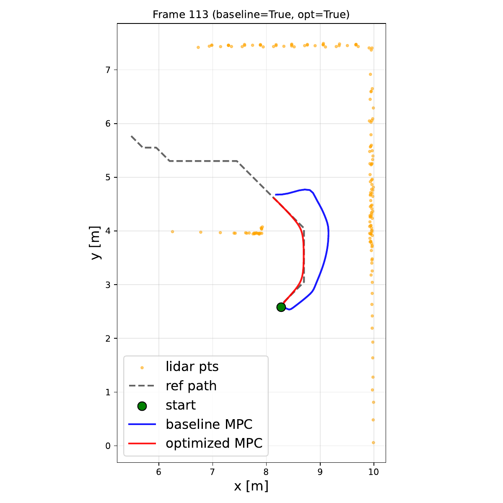
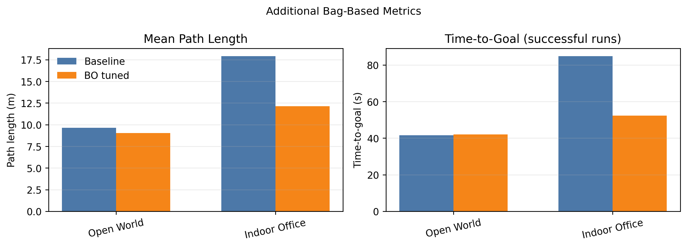

# Bayesian Optimization for Learning Nonlinear MPC in Autonomous Agent Navigation

**Authors:** Lorenzo Ortolani, Gabriel Voss, Gabriele Beltrami, Francesco Dorati, Tommaso Felice Banfi

**Affiliations:** Talos Robotics AI, Milan, Italy

[](documentation/conference_101719.pdf) [](https://docs.ros.org/en/humble/) [](https://gazebosim.org/) [](https://www.unitree.com/go2/) [](LICENSE)

---

## Abstract

Real-time autonomous navigation in dynamic, unknown environments remains a fundamental challenge for mobile robotics. We propose a **map-free framework** that tightly integrates reactive rolling-horizon planning with **nonlinear Model Predictive Control (MPC)**. At each control cycle, a LiDAR-based **Gaussian occupancy representation** is constructed and used to generate collision-free trajectories via **A\* search**, which are then tracked by a **CasADi/IPOPT MPC** formulation incorporating a smooth sigmoid obstacle barrier. To improve robustness to parameter sensitivity, we adopt an offline **Bayesian Optimization** scheme based on **Tree-structured Parzen Estimators (TPE)**, which identifies near-optimal controller parameters with respect to a composite navigation objective. A **Gaussian Process surrogate** is additionally used to analyze parameter sensitivity.

The framework is robot-agnostic and is evaluated on the **Unitree Go2** quadruped in Gazebo simulation and on the physical robot. The full system achieves up to a **90.0% navigation success rate** when deployed, along with a **38.9% average improvement** in evaluation metrics across simulated environments.

> **Extension — sim-to-sim benchmark on the Unitree G1 humanoid.** To stress the
> *robot-agnostic* claim beyond a single embodiment and a single simulator, the
> same A\*+MPC + BO stack has been ported to the **Unitree G1** bipedal humanoid
> and is now benchmarked **sim-to-sim**: Go2 in **Gazebo Fortress** against G1 in
> **NVIDIA Isaac Sim**. Introducing the G1 agent (rather than evaluating on the
> Go2 alone) tests whether the planner and the BO-tuned controller transfer
> across both a different morphology *and* a different physics/sensor stack.
> Companion repository: **[G1_navigation](https://github.com/Relo02/G1_navigation)**.

---

## Video Demo (Simulation)

A short video demonstrates the full pipeline running in Gazebo Fortress across the worst case benchmark environment E2 Indoor Office, including the BO-tuned vs. hand-tuned baseline comparison shown in Fig. 4 of the paper.



The clip shows the LiDAR-based Gaussian occupancy grid, the A\* planner producing a collision-free path, and the MPC tracking that path while avoiding obstacles.

### Baseline vs. BO-tuned trajectories

<p align="center">
  
</p>

A single control frame (Fig. 4 in the paper). Both controllers track the same A\* reference (grey dashed) past the LiDAR points (orange): the baseline MPC (blue) follows a wider arc, while the BO-tuned MPC (red) stays closer to the reference. The paper reports a 38.7% path-length reduction and a 53% time-to-goal improvement.

### Baseline vs. BO-tuned aggregate metrics

Aggregate metrics over the **E1 Open World** and **E2 Indoor Office** benchmarks. Baseline is blue, BO-tuned is orange.



In the Indoor Office environment, mean path length and time-to-goal are both lower for the BO-tuned controller.

---

## Repository Structure

```
Go2_navigation/
├── src/
│   ├── a_star_mpc_planner/   # A* local planner + Nonlinear MPC tracker (CasADi/IPOPT)
│   ├── robot_sim/            # Gazebo Fortress launch, worlds, RViz configs
│   ├── robot_nav/            # Navigation-graph node (Dijkstra global memory)
│   ├── robot_safety/         # E-stop, watchdog, /cmd_vel safety gate
│   ├── go2_bringup/          # Unitree Sport-API hardware bridge (cmd_vel → /api/sport/request)
│   ├── go2_real_bringup/     # ★ Real-robot top-level launch (A*+MPC over Unitree built-in ctrl)
│   ├── go2_real_lidar/       # ★ /utlidar/cloud → /lidar/points_filtered adapter
│   ├── go2_real_planner/     # ★ A*+MPC launch wrapper with BO-YAML selector
│   ├── go2_real_goal_manager/# ★ RViz /goal_pose relay + waypoint mission runner
│   ├── go2_description/      # URDF / Xacro for the Unitree Go2
│   ├── go2_sim/              # Go2-specific Gazebo plugins and meshes
│   ├── champ/                # CHAMP hierarchical locomotion controller
│   ├── champ_base/           # Quadruped kinematics base (CHAMP)
│   ├── champ_msgs/           # CHAMP message definitions
│   ├── sim_worlds/           # Gazebo worlds (E1 Open, E2 Office, E3 Warehouse)
│   ├── sim_scenarios/        # Predefined navigation tasks per environment
│   ├── sensor_models/        # LiDAR, IMU, odometry plugin configs
│   ├── unitree_api/          # Unitree SDK ROS 2 bindings
│   ├── unitree_go/           # Unitree Go2 message definitions
│   ├── robot_common_interfaces/  # Shared msg/srv definitions
│   ├── d1_sim/               # Auxiliary robot description (D1)
│   └── PointCloud-GNNencoder/    # DGCNN encoder (future work, see Roadmap)
├── tuning/                   # Offline Bayesian Optimization (TPE + GP surrogate)
├── bag_gp_tuning/            # Recorded rosbags used for GP sensitivity analysis
├── bags_recordings/          # Trial recordings for offline metric extraction
├── documentation/            # Accepted paper, figures, and LaTeX sources
├── run_metrics_collection.sh # Batch runner for evaluation scenarios
├── run_direct_comparison.sh  # Side-by-side baseline vs. tuned-parameter trial
├── record_bag.sh             # Helper to record per-trial rosbags
└── kill_ros_nodes.sh         # Cleanly shut down all ROS 2 nodes between trials
```

---

## Installation

### Prerequisites

- **Ubuntu 22.04** (host) or matching Docker image
- **ROS 2 Humble**
- **Python >= 3.10**
- **Gazebo Fortress** (for simulation)
- **CasADi** and **IPOPT** (for the MPC NLP)
- A LiDAR-equipped **Unitree Go2** (for real deployment) and a **Jetson Orin Nano** onboard

> **Note:** The full stack was developed and validated inside a ROS 2 Humble Docker container. A ready-made image is available under `~/docker-go2`.

### 1. Launch the Docker Container

```bash
cd ~/docker-go2
./run.sh humble
```

### 2. Clone and Enter the Workspace

```bash
cd ~
git clone <repository-url> Go2_navigation
cd ~/Go2_navigation
```

### 3. Install Python Dependencies

```bash
pip install -r requirement.txt
pip install -r tuning/requirement.txt
```

### 4. Build the ROS 2 Workspace

```bash
colcon build --symlink-install
source install/setup.bash
```

### 5. Verify Installation

```bash
ros2 pkg list | grep -E "a_star_mpc_planner|robot_sim|champ"
```

Expected output:
```
a_star_mpc_planner
champ
champ_base
champ_msgs
robot_sim
```

---

## Quick Start: Deployment

### Simulation (Headless, recommended for remote PCs)

Default for SSH / remote servers. Gazebo runs without a display; the sensors plugin uses Mesa software rendering (`llvmpipe`) so no GPU or `DISPLAY` is needed.

```bash
ros2 launch robot_sim sim_a_star_mpc.launch.py
```

`LIBGL_ALWAYS_SOFTWARE=1` is set automatically by the launch file when `gui:=false` (the default), so OGRE2 initialises on CPU without a physical GPU.

### Simulation (GUI mode)

```bash
ros2 launch robot_sim sim_a_star_mpc.launch.py gui:=true use_rviz:=true
```

Available world selection (see [src/sim_worlds/](src/sim_worlds/)):

```bash
ros2 launch robot_sim sim_a_star_mpc.launch.py world:=e1_open      # E1 — Open
ros2 launch robot_sim sim_a_star_mpc.launch.py world:=e2_office    # E2 — Indoor Office
ros2 launch robot_sim sim_a_star_mpc.launch.py world:=e3_warehouse # E3 — Warehouse (held-out)
```

### Send a Navigation Goal

In a second terminal:

```bash
ros2 topic pub --once /global_goal geometry_msgs/PoseStamped \
  '{header: {frame_id: "map"}, pose: {position: {x: 5.0, y: 5.0, z: 0.0}}}'
```

### Real Robot (Unitree Go2)

On the physical Go2 we drive the robot through its **built-in Sport-mode controller** via Unitree's Sport API — **no CHAMP**. The MPC publishes body-frame `/cmd_vel`, and `go2_bringup/go2_hw_bridge` forwards each command to `/api/sport/request`, which the Go2 onboard controller consumes natively.

A dedicated deployment workspace, [`go2_real_*`](src/go2_real_bringup/), wires everything together with one entry point:

```bash
# CycloneDDS + interface pinning required — see go2_real_bringup/README.md
ros2 launch go2_real_bringup go2_real_full.launch.py
```

This brings up the URDF publisher, the Unitree Sport-API hardware bridge, the L1 LiDAR adapter, the A\*+MPC planner, the safety gate, the goal manager, and RViz2.

Switch between hand-tuned baseline and BO-tuned parameters at launch time:

```bash
# BO-tuned (default)
ros2 launch go2_real_bringup go2_real_full.launch.py use_bo_params:=true

# Hand-tuned baseline (Phase 0 reference)
ros2 launch go2_real_bringup go2_real_full.launch.py use_bo_params:=false

# Custom YAML (e.g. a freshly produced tuning result)
ros2 launch go2_real_bringup go2_real_full.launch.py \
  params_file:=$HOME/Go2_navigation/tuning/tuning_results/best_planner_params.yaml
```

Run a reproducible waypoint mission for benchmarking:

```bash
ros2 launch go2_real_bringup go2_real_full.launch.py \
  mission_file:=$(ros2 pkg prefix go2_real_goal_manager)/share/go2_real_goal_manager/config/example_mission.yaml
```

**DDS:** the entire pipeline talks to the Go2 via **CycloneDDS** pinned to the network interface bridged to the robot's internal `192.168.123.0/24` network. See [src/go2_real_bringup/README.md](src/go2_real_bringup/README.md) for the required `RMW_IMPLEMENTATION` + `CYCLONEDDS_URI` setup and the bundled `cyclonedds_profile.xml`.

---

## Parameter Tuning (Offline Bayesian Optimization)

MPC cost weights and geometric thresholds can be automatically tuned by the Bayesian optimiser in [tuning/](tuning/). It runs the full Gazebo stack across multiple navigation scenarios and uses **Tree-structured Parzen Estimators (TPE)** to identify the parameter set that maximises a composite navigation score (success, path efficiency, smoothness, obstacle clearance, time to goal).

### Run a Tuning Campaign

```bash
cd tuning
python3 bayesian_mpc_tuner.py --trials 120 --random 20            # headless
python3 bayesian_mpc_tuner.py --trials 120 --random 20 --gui      # with Gazebo GUI
```

Results, per-trial logs, and the best parameter file are written to `tuning_results/`.

### Deploy Tuned Parameters

```bash
cp tuning_results/best_planner_params.yaml \
   src/a_star_mpc_planner/config/planner_params.yaml
```

### Sensitivity Analysis (GP Surrogate)

After tuning, fit an ARD Matérn-5/2 Gaussian Process to all accumulated trials to rank parameter importance:

```bash
jupyter notebook gp_bag_mpc_cost_optimization.ipynb
```

See [tuning/BAYESIAN_MPC_TUNER.md](tuning/BAYESIAN_MPC_TUNER.md) for the full methodology, scoring formulation, and detailed running modes.

---

## Evaluation

### Batch Metrics Collection

Run the full evaluation suite (E1, E2, E3) for both the baseline and the tuned parameter sets and aggregate the metrics:

```bash
./run_metrics_collection.sh
```

This script launches each scenario, records a rosbag per trial in `bags_recordings/`, and extracts success rate, time to goal, path length, and average MPC solve time.

### Direct Baseline vs. Tuned Comparison

```bash
./run_direct_comparison.sh
```

Reproduces the trajectory comparison plots reported in the paper (Fig. 4).

### Diagnostics

Monitor MPC solver health in real time:

```bash
ros2 topic echo /mpc/diagnostics
# data: [success(0/1), cost, solve_time_ms, avg_solve_ms, total_failures]
```

| Topic | Type | Visualisation |
|---|---|---|
| `/a_star/occupancy_grid` | `OccupancyGrid` | Gaussian obstacle map |
| `/a_star/path` | `Path` | A\* waypoint path |
| `/mpc/predicted_path` | `Path` | MPC predicted trajectory (N steps) |
| `/mpc/next_setpoint` | `PoseStamped` | Current lookahead setpoint |

---

## Component Overview

| Package | Description |
|---|---|
| [`a_star_mpc_planner/`](src/a_star_mpc_planner/) | Rolling-horizon A\* planner on a Gaussian occupancy grid + Nonlinear MPC tracker built with CasADi/IPOPT |
| [`robot_nav/`](src/robot_nav/) | Topological navigation graph (Dijkstra global memory) inspired by WildOS, feeding waypoints to the local planner |
| [`robot_sim/`](src/robot_sim/) | Gazebo Fortress launch files, RViz configs, and headless/GUI mode toggles |
| [`robot_safety/`](src/robot_safety/) | E-stop, `/cmd_vel` watchdog, and setpoint-timeout safety gate |
| [`go2_bringup/`](src/go2_bringup/) | Unitree Sport-API hardware bridge: `cmd_vel` ↔ `/api/sport/request`, `SportModeState` → `odom` + TF |
| [`go2_real_bringup/`](src/go2_real_bringup/) | **Real-robot deployment**: orchestrates A\*+MPC over the Unitree built-in controller (no CHAMP). Includes CycloneDDS profile and RViz config |
| [`go2_real_lidar/`](src/go2_real_lidar/) | Adapter for the built-in Unitree L1 LiDAR: `/utlidar/cloud` → `/lidar/points_filtered` (range + height filter, voxel downsample, TF to `odom`) |
| [`go2_real_planner/`](src/go2_real_planner/) | Real-robot launch wrapper around `a_star_mpc_planner`, with a BO-YAML selector (bundled default + bundled BO-tuned + arbitrary override) |
| [`go2_real_goal_manager/`](src/go2_real_goal_manager/) | RViz `/goal_pose` → `/global_goal` relay + waypoint-mission runner (YAML-driven benchmarks) |
| [`go2_description/`](src/go2_description/) | URDF / Xacro and meshes of the Unitree Go2 |
| [`champ/`](src/champ/), [`champ_base/`](src/champ_base/) | CHAMP hierarchical locomotion controller — used **only in simulation**; real-robot deployment uses the Go2's built-in controller via `go2_bringup` |
| [`sim_worlds/`](src/sim_worlds/) | Gazebo worlds for E1 (Open), E2 (Indoor Office), and E3 (Warehouse, held-out) |
| [`sim_scenarios/`](src/sim_scenarios/) | Predefined start/goal navigation tasks per environment |
| [`tuning/`](tuning/) | Offline Bayesian Optimization pipeline (TPE) and GP surrogate analysis |
| [`PointCloud-GNNencoder/`](src/PointCloud-GNNencoder/) | DGCNN encoder for future scan-conditioned MPC tuning (see Roadmap) |

---

## Roadmap

Three primary extensions are planned for upcoming releases:

1. **Online Bayesian Optimization** — warm-started from the offline tuned vector, an online GP-based BO loop will adapt MPC parameters incrementally during deployment, enabling environment-specific refinement for out-of-distribution settings without offline retraining.
2. **Scan-Conditioned MPC Tuning (DGCNN)** — a self-supervised Dynamic Graph CNN encoder will provide scan-level, annotation-free MPC parameter conditioning from raw LiDAR embeddings.
3. **Unitree G1 + VLA Integration** — *in progress.* The stack has been ported to the **Unitree G1** bipedal humanoid in the companion [G1_navigation](https://github.com/Relo02/G1_navigation) repo, where it runs in **NVIDIA Isaac Sim** for an ongoing **sim-to-sim benchmark** (Go2/Gazebo ↔ G1/Isaac) of the same A\*+MPC + Bayesian-Optimization pipeline. Next steps: interface with Visual Language Action models for natural-language goal decomposition, with lifelong continual online learning from real-world data.

---

## Citation

If you use this code in your research, please cite the paper:

```bibtex
@inproceedings{ortolani2026bopt_mpc,
  title     = {Bayesian Optimization for Learning Nonlinear MPC in Autonomous Agent Navigation},
  author    = {Ortolani, Lorenzo and Voss, Gabriel and Beltrami, Gabriele and Dorati, Francesco and Banfi, Tommaso Felice},
  booktitle = {Proceedings of the IEEE/ICRA International Conference},
  year      = {2026},
  organization = {Talos Robotics AI}
}
```

---

## Acknowledgements

We thank the authors of the following works for open-sourcing their code:

- [CasADi](https://web.casadi.org/) — symbolic framework for nonlinear optimization
- [IPOPT](https://coin-or.github.io/Ipopt/) — interior-point NLP solver
- [CHAMP](https://github.com/chvmp/champ) — hierarchical quadruped locomotion controller
- [Hyperopt](https://github.com/hyperopt/hyperopt) — TPE Bayesian Optimization
- [WildOS](https://github.com/nasa-jpl/nebula2-wildos) — inspiration for the topological navigation graph

---

## License

This project is released under the [GNU General Public License v3.0](LICENSE).
