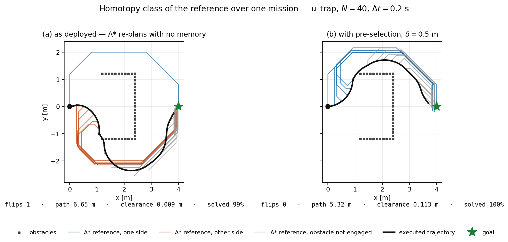
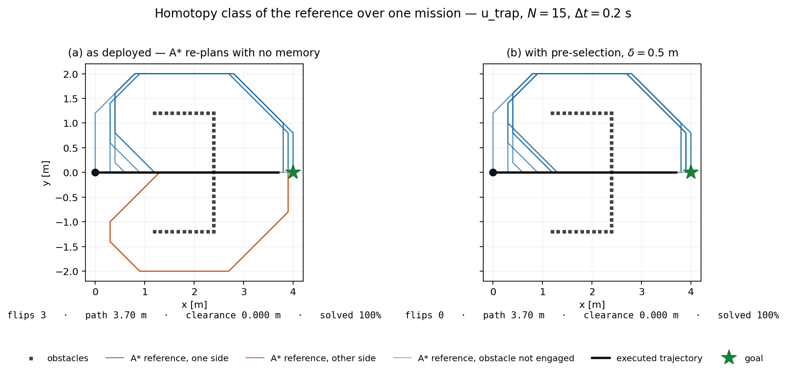

# The left/right decision: where it is made, how to measure it, how to stabilise it

Guide to the work on branch `nonconvexity_decision`. Written so that someone who has not
followed the thread can reproduce every number in half an hour.

Related documents: [`roadmap_teorica_noc.md`](roadmap_teorica_noc.md) §5.4 (regularity of
$x^\star(\vartheta)$, Thm 4.4.6), [`Recap.md`](Recap.md) (running a mission end to end),
[`visualizzazione_ottimizzazione.md`](visualizzazione_ottimizzazione.md) (the two panels).

---

## 0. The short version

The task was "solve the non-convexity of the obstacle avoidance, for the case where the robot
has to choose left or right and does not know which".

The finding is that **the choice is not made in the MPC**. At the deployed weights the cost
landscape has a single minimum, so the nonlinear program never picks a side: it tracks
whatever reference it is handed. The choice is made by A\*, which re-plans every few cycles
with no memory of what it chose last time, and changes its mind mid-mission.

Two tools were added. One counts how often that happens. The other stops it, by committing to
a homotopy class and only switching when a challenger is better by a margin `delta`.

---

## 1. Why it is not the MPC

This was settled before anything was built, because the remedy is completely different
depending on the answer.

`viz/bifurcation_sweep.py` (Francesco's, §10.5 of the roadmap) solves the same instance twice,
warm-started to the left and to the right, and measures the distance between the two solutions
in $\mathbb{R}^{141}$:

| `W_obs` | separation | verdict |
|---|---|---|
| 60 | 0.0000 | single minimum |
| 120 | 0.0000 | single minimum ← **deployed** |
| 200 | 0.0000 | single minimum |
| 300 | 3.6888 | bifurcates |
| 1400 | 4.4877 | bifurcates |

The threshold sits between 200 and 300; the deployed weight is 120. On the hardest cycle of
the recorded run the landscape does not split **even at 1400**, because that cycle has a
critical cone of dimension one: with 141 variables and 140 active constraints there is no room
for two basins. Constraint saturation removes the bifurcation before the weight can create it.

So a symmetry-breaking term inside the NLP would be fixing a phenomenon that does not occur.
The discrete choice lives upstream, in the reference generator.

This is also the reason the course reference for this work is **§4.2.6** (avoid integer
variables; pre-select the switching strategy with continuous tuning parameters) rather than
§4.4.5 alone. "Which side do I pass on" is the integer variable the formulation refuses to
carry, and the stack already delegates it. What was missing is any guarantee that the
delegation is self-consistent.

---

## 2. Measuring the delegated choice — `viz/homotopy_flips.py`

### What a flip is

Obstacle returns are grouped into connected clusters (radius graph, link 0.30 m). For each
cluster the reference passes near, the tool records **which side it passes on**, and a *flip*
is a cluster engaged by two consecutive references whose side differs. Clusters engaged by
only one of the two are ignored: entering or leaving the planning window is not a change of
mind.

### How the side is read, and why not more simply

The side is the sign of the lateral offset between the reference and the obstacle, taken at
the obstacle's longitudinal station, in the frame fixed by the start pose and the goal. The
landmark is the **obstacle point nearest the reference**, which behaves the same on a compact
pillar and on a wall running parallel to travel.

Two simpler definitions were implemented first and both measure the wrong thing. They are
recorded here so nobody repeats them:

| definition | why it fails |
|---|---|
| sign of `cross(path tangent, obstacle − closest point)` | flips whenever the path merely *curves*, without changing side |
| sign of the winding angle about the obstacle | the correct invariant for a *fixed* path, but under a receding horizon it flips as the robot advances *past* the obstacle, so it encodes longitudinal progress. On `corridor` it made all three clusters flip on the same cycle, which is the fingerprint of the frame moving rather than of A\* changing its mind |
| centroid as landmark (instead of nearest point) | arbitrary for a wall the path runs alongside; hid the fact that on `corridor` A\* leaves the corridor entirely |

### Results, deployed profile

```
python3 viz/homotopy_flips.py
```

| scenario | clusters | re-plans | flips | min. clearance |
|---|---|---|---|---|
| `u_trap` | 1 | 12 | **3** | 0.000 m |
| `corridor` | 3 | 11 | **5** | 0.070 m |
| `narrow_gap` | 2 | 10 | 0 | 0.450 m |
| `centred_pillar` | 1 | 5 | 0 | 0.010 m |

On `u_trap` the recorded offset is **2.0 m at every flip** while the sign alternates: the
reference translates four metres across a stationary obstacle, three times, with nothing in
the world having changed. On `corridor` the offsets reveal something separate and worth
knowing: A\* is routing around the **outside** of the corridor walls, alternating which side
it leaves by.

`narrow_gap` and `centred_pillar` measure zero, correctly. The previous detector in
`cost_field.py:364` (sign of the reference's largest $|y|$) reported false positives on both.

Output: `viz/out/homotopy_flips.json`, with the full per-re-plan signature trace.

---

## 3. Stabilising it — `viz/homotopy_lock.py`

At each re-plan:

1. A\* runs normally and produces a candidate route.
2. Its signature is compared with the committed one. If they agree, nothing else is computed.
3. If they disagree, a route **in the committed class** is recovered, from two sources in order
   of preference:
   - the route already being followed, re-anchored at the current pose and re-checked for
     collisions. This is what hysteresis plainly means and is almost always available;
   - failing that, a fresh A\* run behind a temporary barrier on the side the challenger chose.
     This is the fallback and can legitimately fail when the committed side is no longer
     reachable.
4. Both are scored **against the real obstacles**:

   ```
   J_route = path length + w_clear * ∫ max(0, d_ref − clearance) ds
   ```

   The first term is A\*'s own `g`; the second is the gap-width criterion, written so that
   squeezing past an obstacle is paid for in the same units as a detour.
5. The challenger is adopted only if `J_new < J_old − delta`. Otherwise the committed class is
   kept.

**Nothing in the NLP changes.** The layer wraps the planner via a context manager, so
`common.closed_loop` is untouched and `J*` on any single cycle is unaffected. The honest
baseline is `--off` (the unmodified planner), not `--delta 0`: at zero margin ties already
resolve towards the incumbent.

### Results

```
python3 viz/homotopy_lock.py --delta 0.5
python3 viz/homotopy_lock.py --scenario u_trap --sweep 0 0.25 0.5 1.0 2.0 --set mpc_N=40
```

| scenario | flips off | flips on | held/conflicts |
|---|---|---|---|
| `u_trap` | 3 | **0** | 2/2 |
| `corridor` | 5 | **1** | 4/4 |
| `narrow_gap` | 0 | 0 | 0/0 |
| `centred_pillar` | 0 | 0 | 0/0 |

The `delta` sweep, on `u_trap`:

| `delta` | flips (N=15) | flips (N=40) | path (N=40) | clearance (N=40) | solved |
|---|---|---|---|---|---|
| off | 3 | 1 | 6.65 m | 0.009 m | 99 % |
| 0 | 1 | 1 | 6.65 m | 0.009 m | 99 % |
| 0.25 | **0** | **0** | **5.32 m** | **0.113 m** | **100 %** |
| 0.5 – 20 | **0** | **0** | **5.32 m** | **0.113 m** | **100 %** |

Three readings:

- **`delta = 0` is not enough.** With no margin the challenger wins on any improvement however
  small and the flips survive. The hysteresis has to be strictly positive to exist at all,
  which is the content of the notes' phrase "continuous tuning parameter".
- **Everything saturates from 0.25 upward.** The value in use sits on a plateau, not at a
  fitted optimum. That is a more defensible thing to write in the report than a tuned number.
- **The trade-off could not be measured.** See §5.

---

## 4. Current results, in pictures

Both figures come from `viz/homotopy_figure.py`. Panel (a) is the planner as deployed,
panel (b) the same mission with the pre-selection layer at `delta = 0.5`. Every A\* reference
produced during the mission is drawn, coloured by which side of the obstacle it passes on;
the executed trajectory is the black curve.

### The improvement, at a horizon long enough to see it



*`viz/out/homotopy_u_trap_N40.png` — also available as `.pdf`. Regenerate with
`python3 viz/homotopy_figure.py --no-show`.*

Read it left to right. In (a) the first reference goes over the top of the U, then A\* changes
its mind and every subsequent reference goes underneath; the robot commits to the longer route
round the bottom and scrapes the obstacle at 9 mm. In (b) the class is decided once and held:
one colour, the short way over the top, with real clearance.

| | flips | path | min. clearance | solved cycles |
|---|---|---|---|---|
| as deployed | 1 | 6.65 m | 0.009 m | 99 % |
| with pre-selection | **0** | **5.32 m** | **0.113 m** | **100 %** |

Path 20 % shorter, clearance 12× larger, no failed solves. Same scenario, same weights, same
everything else: the only difference is that the reference stopped changing class.

### The same mission at the deployed horizon



*`viz/out/homotopy_u_trap_deployed.png`. Regenerate with
`python3 viz/homotopy_figure.py --no-show --set mpc_N=15 --tag deployed`.*

This one needs reading carefully, and is the reason §5 exists.

The references flip between blue and orange in (a) and are all blue in (b), so the layer is
doing its job. But **the black curve is identical in both panels**, and it is a straight line
from start to goal that passes clean through the back wall of the U. Clearance 0.000 m.

That is not the layer failing. At `N = 15` the horizon covers about 0.6 m, the obstacle is
further away than that, so the barrier never sees it; the harness then drives at the goal with
a proportional controller, and the kinematic plant has no collision. It is a property of the
test bench, not of the controller, and it is exactly why the deployed-horizon configuration
cannot demonstrate any benefit. **Do not show this figure without that explanation**, and do
not quote a closed-loop number from this harness at `N = 15`.

---

## 5. What to expect, and what not to

### At the deployed horizon the fix changes nothing in the trajectory

On `u_trap` at `N = 15`, with the layer enabled, the executed trajectory is **identical to the
baseline in every digit**: same length (3.698 m), same clearance, same cycle count, while the
flip count goes from 3 to 0.

The reason is the horizon. $N\Delta t = 3$ s at $v_\text{ref} = 0.2$ m/s spans about 0.6 m of
path, and the two routes do not separate within that distance. The reference swings four
metres sideways and the controller never sees it, because the divergence lies beyond the last
predicted node.

At `N = 40` the controller does see it, and the same fix is worth 6.65 → 5.32 m of path,
0.009 → 0.113 m of clearance, and 99 → 100 % solved cycles.

**The deployed horizon is not robust to the inconsistent reference; it is too short to be
affected by it.** That is the substantive result, and it inverts the usual reading of the
horizon sweep: there the short horizon looked merely dominated, here it is what conceals a
defect in the layer above.

### The offline harness lets the robot pass through obstacles

Worth knowing independently of this work. In `common.closed_loop` at the deployed profile the
travelled clearance is 0.000 m on `u_trap`, 0.010 m on `centred_pillar` and 0.070 m on
`corridor`. The harness tracks a look-ahead setpoint with a proportional controller, the plant
is kinematic with no collision, and at `N = 15` the barrier never sees an obstacle more than
0.6 m away. **Any closed-loop claim from this harness at the deployed horizon is measuring the
outer proportional loop, not the MPC.** This is the same limitation already declared for
`robust_constraints` in §10.16 of the roadmap.

---

## 6. What is not established

Listed in rough order of how much they weaken the result.

1. **No sensing model.** `plan_astar` rebuilds the grid from the *complete* obstacle set on
   every re-plan: no occlusion, no field of view, no range limit inside the 6 m grid. On
   `u_trap` all 43 obstacle points lie 1.70–2.68 m from the start, so A\* knows the U is closed
   from cycle 0 and never plans into it. What is measured is therefore the *easier* case:
   oscillation between two fully observed, nearly equal routes. The harder case, entering a U
   and discovering the back wall only when deep inside, is not covered.

2. **The cost of hysteresis was never observed.** `delta` was pushed to 20, far beyond any
   route cost in these scenarios, and nothing degraded, because in this set the committed class
   is never the worse one. Demonstrating the trade-off needs a scenario where the world changes
   after the commitment is made. That is the same experiment as item 1, which makes it the
   single highest-value thing to add.

3. **`corridor` still flips once.** The mechanism is effective, not complete.

4. **Not confirmed on a bag.** Everything above is synthetic scenarios in the offline harness.
   The tools accept `--bag`-derived scenarios in principle, but no recorded mission has been
   run through them.

5. **The report macros are hand-transcribed.** `viz/out/tex/homotopy_macros.tex` and the two
   table files carry numbers typed from the JSON rather than generated. This breaks the
   project's own rule and already cost one bug (a `$\astar$` versus `\astar{}` error that
   `results_tex.py --check` would have caught).

---

## 7. What could be improved, in order

| # | Work | Effort | Why |
|---|---|---|---|
| 1 | **Sensing model in the bench** — filter obstacle points by range and forward FOV before the grid update, so the back wall of a U appears only when close enough | half a day | unlocks the entrapment case *and* the missing trade-off measurement in one change |
| 2 | **`viz/homotopy_tex.py`** — emit the macros and tables from the JSON, hooked into `results_tex.py` like the other satellite scripts | ~1 h | closes item 5 above; the report becomes self-updating |
| 3 | **Diagnose the residual `corridor` flip** | ~1 h | and separately: find out why A\* prefers to leave the corridor at all. That may be a scenario-definition issue rather than a planner one |
| 4 | **Confirm on a recorded mission** | depends on a bag | turns a synthetic result into a deployed one |
| 5 | **Port the layer into `a_star_planner.py`** as an `MPCConfig`-style switch defaulting to off | half a day | only worth doing once 1–4 say it is the right behaviour. Today it lives in `viz/` as an experiment |

---

## 8. Files

| File | What |
|---|---|
| `viz/homotopy_flips.py` | the metric. `--scenario`, `--profile`, `--engage`, `--link`, `--out` |
| `viz/homotopy_lock.py` | the layer + before/after measurement. `--delta`, `--sweep`, `--off` |
| `viz/homotopy_figure.py` | the before/after figure. `--set mpc_N=40` is the informative one |
| `viz/out/homotopy_flips.json` | per-re-plan signature trace |
| `viz/out/homotopy_lock.json` | before/after, all scenarios, `delta = 0.5` |
| `viz/out/homotopy_lock_sweep_*.json` | the `delta` sweeps |
| `viz/out/homotopy_u_trap_N40.{png,pdf}` | the figure to put in the report |
| `viz/out/homotopy_u_trap_deployed.{png,pdf}` | same at `N = 15`; references flip, trajectory identical |
| `report_draft/sec_homotopy.tex` | the report subsection |
| `viz/out/tex/homotopy_macros.tex`, `tab/homotopy{,delta}.tex` | its macros and tables |

Requirements are the `viz/` set only: CasADi, NumPy, SciPy, matplotlib, PyYAML. **No ROS, no
MuJoCo, no bag.** Everything above runs on a laptop in a virtualenv.

Note on matplotlib: the figure code needs **3.10.x**. On 3.11 the 3-D panels fail with
`ufunc 'isfinite' not supported`, a regression in `mplot3d`'s new `_scale_invalid_mask`.

---

## 9. Where it is in the report

Subsection **`sec:homotopy`**, "Where the discrete choice is actually made", placed
immediately after `sec:bif`, of which it is the continuation: `sec:bif` proves the program has
a unique minimum, this one asks who decides then.

In `Report_metrics_v3.tex` it is §5.5, on pages 23–25. Pull request:
`Relo02/NOC_report` #1, branch `homotopy_and_v3`.
